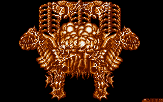
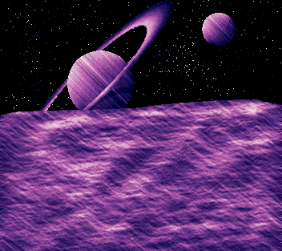
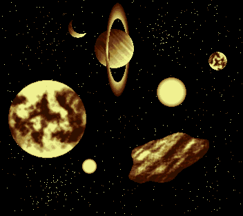

# Amiga Pixelart

Pixelart drawn with Deluxe Paint on the Commodore Amiga around 1990. 

Artemis from Phelios (Namco 1990). This image was redrawn from a magazine screenshot of the Mega Drive version.

R-Type (Irem 1987). This image was redrawn from a magazine screenshot of the arcade version. The explosion were added later.

Brain. This was intended as a boss for a shoot'em up game I was working on. It only has 8 colors so that it could be used in dual playfield mode.

 

Early steps with Deluxe Paint II from back in the day.
