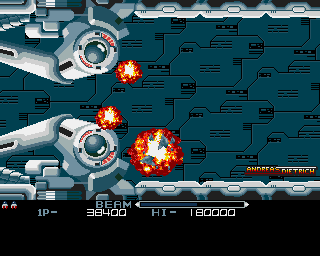

# Amiga Pixelart

Pixelart drawn with Deluxe Paint on the Commodore Amiga around 1990. 

Artemis from Phelios (Namco 1990). This image was redrawn from a magazine screenshot of the Mega Drive version.

R-Type (Irem 1987). This image was redrawn from a magazine screenshot of the arcade version. The explosion were added later.
